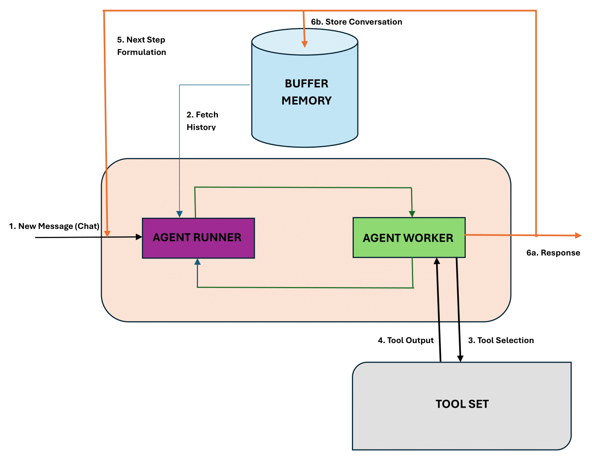

# RaidenX Agent

A sophisticated AI-powered trading assistant built with FastAPI and LLM integration, specialized in meme coin trading on the SUI network.

## 🤖 Core Components

### Agent Runner (Orchestrator)
- Task state management
- Memory buffer handling
- API endpoint routing
- Request scheduling
- Webhook processing

### Agent Worker (Executor)
- Chain-of-thought reasoning
- Tool selection logic
- Decision making
- Response formulation
- Context management

## 🌟 Key Features

- **Advanced Trading Capabilities**
  - Real-time token search
  - Wallet balance tracking
  - Position management
  - Buy/sell order execution
  - Portfolio analysis

- **Multi-LLM Support**
  - Google Gemini Pro
  - Anthropic Claude
  - DeepSeek
  - Model selection flexibility

- **Intelligent Processing**
  - Context-aware conversations
  - Chain-of-thought reasoning
  - Memory management
  - Asynchronous processing
  - Stream response support

- **Security & Performance**
  - JWT authentication
  - Rate limiting
  - Error handling
  - Request validation
  - Logging system

## 🏗 Architecture


### Control Flow



## 📁 Project Structure

```
raidenx-agents/
├── LLM/                    # LLM Integration
│   ├── llm_settings_manager.py
│   └── __init__.py
├── auth/                   # Authentication
│   ├── authorization.py
│   └── jwt_generator.py
├── commons/                # Shared Utilities
│   └── send_telegram.py
├── config/                 # Configuration
│   ├── settings.py
│   └── __init__.py
├── prompts/                # System Prompts
│   ├── react.py
│   └── __init__.py
├── routes/                 # API Routes
│   └── chat_agent.py
├── tools/                  # Trading Tools
│   ├── get_wallet_balance.py
│   ├── search_token.py
│   └── get_positions.py
├── utils/                  # Helpers
│   ├── chat_session.py
│   └── output_parser.py
├── app.py                  # Main Application
├── agents.py              # Core Agent Logic
└── docker-compose.yml     # Docker Config
```

## 🚀 Installation

### Prerequisites
- Python 3.10+
- Docker (optional)
- API keys for:
  - Anthropic Claude
  - DeepSeek
  - Google Gemini Pro

### Docker Setup

```bash
docker compose up --build -d
```

### Local Setup

1. Clone the repository:
```bash
git clone https://github.com/yourusername/raidenx-agents.git
cd raidenx-agents
```

2. Create virtual environment:
```bash
python -m venv venv
source venv/bin/activate  # Linux/Mac
# or
.\venv\Scripts\activate  # Windows
```

3. Install dependencies:
```bash
pip install -r requirements.txt
```

4. Configure environment:
```bash
cp .env.example .env
# Edit .env with your configuration
```

5. Run the server:
```bash
bash runserver.sh
```

## ⚙️ Configuration

### Required Environment Variables

```env
# RaidenX API URLs
RAIDENX_API_COMMON_URL=https://api.dextrade.bot
RAIDENX_API_INSIGHT_URL=https://api-insight.dextrade.bot
RAIDENX_API_ORDERS_URL=https://api-orders.dextrade.bot
RAIDENX_API_WALLETS_URL=https://api-wallets.dextrade.bot

# AgentFai Config
AGENTFAI_API_URL=https://api-agentfai.dextrade.bot
AGENTFAI_API_KEY=your_api_key_here

# LLM API Keys
ANTHROPIC_API_KEY=your_anthropic_key
DEEPSEEK_API_KEY=your_deepseek_key

# Security
SECRET_KEY=your_jwt_secret_key
```

## 🔌 API Endpoints

### Chat Endpoints

#### Synchronous Chat
```http
POST /v1/chat/threads/messages/sync
Content-Type: application/json
Authorization: Bearer <jwt_token>

{
    "content": "string",
    "message_id": "string",
    "thread_id": "string"
}
```

#### Asynchronous Chat with Webhook
```http
POST /v1/chat/threads/messages
Content-Type: application/json
Authorization: Bearer <jwt_token>

{
    "content": "string",
    "message_id": "string",
    "thread_id": "string"
}
```

## 🛠 Development

### Running Tests
```bash
pytest tests/
```

### Code Style
```bash
black .
flake8 .
```

## 🤝 Contributing

1. Fork the repository
2. Create feature branch (`git checkout -b feature/amazing-feature`)
3. Commit changes (`git commit -m 'Add amazing feature'`)
4. Push to branch (`git push origin feature/amazing-feature`)
5. Open Pull Request

## 📄 License

This project is licensed under the MIT License - see the [LICENSE](LICENSE) file for details.

## 📞 Support

- Email: hung.dang@sotatek.com
- Issue Tracker: [GitHub Issues](https://github.com/yourusername/raidenx-agents/issues)

## 🙏 Acknowledgments

- [FastAPI](https://fastapi.tiangolo.com/)
- [LlamaIndex](https://www.llamaindex.ai/)
- [Google Gemini](https://deepmind.google/technologies/gemini/)
- [Anthropic Claude](https://www.anthropic.com/claude)
- [DeepSeek](https://deepseek.ai/)
